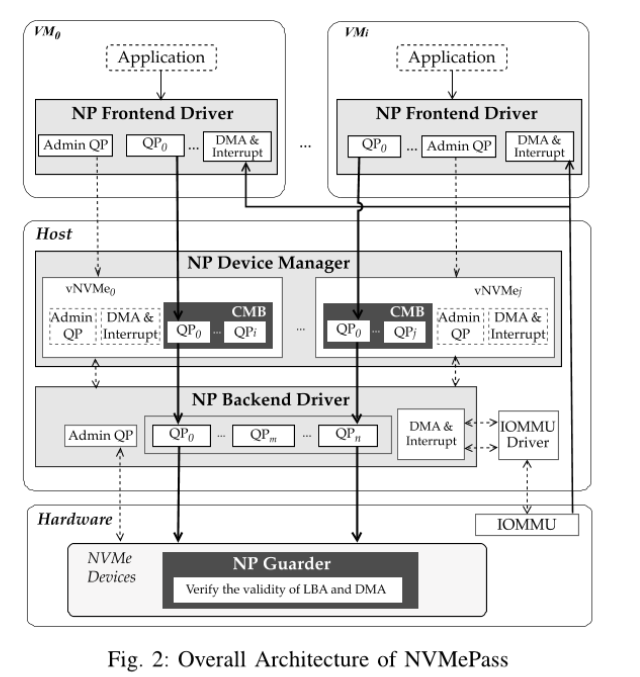
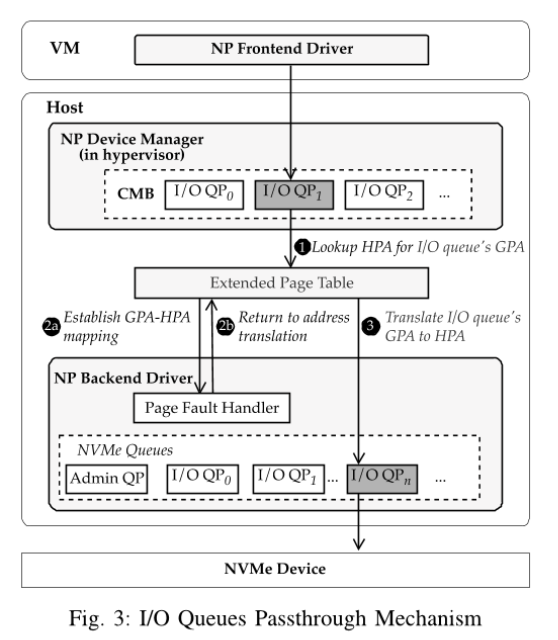

# abstract
绝大多数数据密集型应用都在NVMe存储上运行。现有的NVMe虚拟化技术包括基于软件的和基于硬件辅助的。
virtio存在严重的性能下降问题，而基于轮询的解决方案又会消耗过多的CPU资源。
硬件辅助解决方案能够提供高性能且不占CPU资源，但需要专门的硬件才可以实现。

本文提出NVMePass的新型软硬件协同设计，是一个NVMe直通虚拟化架构，旨在实现高性能且无CPU开销，同时保持高可扩展性。NVMePass的核心思想是为虚拟机直接传递NVMe I/O队列，并采用一种机制来保证其安全性。
NVMePass支持DMA和中断重映射，无需虚拟机管理程序参与，从而消除了虚拟化开销并提供了接近原生的性能。隔离通过为虚拟机独占分配I/O队列和逻辑块(LBA)来实现。
本文同样提出了NVMe Resouce Domain(NRD)，并在NVMe控制器中实现了该功能，以拦截非法I/O请求。因此，隔离性和安全性得到了充分保证。

实验结果表明，NVMePass能提供与VFIO相当的性能。与SPKD-Vhost相比，NVMePass的时延也更低。

# introduction
+ NVMe的重要性
+ NVMe+虚拟化的好处
+ 主流存储虚拟化技术
  + 基于软件：无需硬件额外功能，存在严重性能下降。为了解决性能问题，SPDK-vhost或其它采用轮询的方案，通过CPU轮询的处理和提交I/O请求，提升IO性能，但占用宝贵的CPU资源
  + 硬件辅助：硬件级别复制PCIe功能。虚拟机直接能够访问硬件资源，绕过host软件栈。不消耗额外CPU资源的情况下实现高性能。但需要专门的硬件支持，带来额外的成本和复杂性。
+ 可扩展性：
  + 新型轻量级虚拟机如firecrackers已经能够支持8000个虚拟机在一台服务器上，SR-IOV自然无法支持那么多，SPDK也会消耗太多的CPU资源。

NVMePass具有接近原生的性能，对硬件的要求也很低。其核心思想是为虚拟机直通NVMe I/O队列，以及一种安全保障机制。
设计了一种全新的I/O队列直通框架，使虚拟机能够直接访问I/O队列，从而避免了软件虚拟化带来的高CPU开销挑战。
为了解决直通安全性问题，提出了一个NRD机制来拦截非法的NVMe I/O请求。

NVMePass有两个关键且独特的设计：
+ I/O队列直通框架
+ 直通的安全保障机制

I/O队列是通过在虚拟NVMe设备中创建一个virtual Controller Memory Buffer(CMB)以及一个自定义的page fault handler来在虚拟机和宿主机之间建立直接地址映射来实现。
CMB仅用于虚拟化设备来提供内存映射的支持，并不需要专门的硬件支持。
安全机制是通过NRD，并把NRD集成到NVMe控制器固件中，以拦截非法的NVMe I/O请求。NVMe硬件资源呗独立分配，且为每个虚拟机分配不重叠的安全区域，从而确保强大的隔离性。

NVMePass可提供接近原生的性能，除了通过I/O队列直通外，还支持DMA和中断重映射，适用于无需hypervisor的虚拟机，从而消除虚拟化开销。
把NVMe设备划分为控制资源和数据资源。控制资源包括PCIe configuration space, base addr registers(BARs)和admin queue。
数据资源就是和I/O请求相关的，包括I/O队列，dorrbel registers, 中断资源和LBA。
数据资源会透传给许婵婵。控制资源用于管理NVMe设备，不参与I/O请求。因此，控制资源在管理程序内部通过软件进行模拟，不会对I/O性能造成影响。

NVMePass由4个组件组成:NP前端驱动，NP后端驱动，NP设备管理器，以及NP guarder。NP前端在虚拟机中呈现标准NVMe设备，无需修改客户机的应用程序。
NP后端负责管理NVMe物理数据资源，为虚拟机创建I/O队列和关联的doorbell registers。
这样的配置下允许虚拟机直接访问I/O队列，但仍确保了不同虚拟机之间的I/O队列的隔离。
它还同时支持DMA事务和中断处理，不需要hypervisor的参与。
NP设备管理器位于hypervisor中，模拟控制资源，并将分配的数据资源组合成面向虚拟机的全功能NVMe设备。
NP guarder验证虚拟机提交的NMVe I/O命令的LBA和DMA操作防止恶意租户的破坏。

与现有的硬件辅助方案相比，NVMePass具有轻量、简单和灵活的优势，对于NVMePass，硬件的唯一要求是支持NVMe SSD中的NRD，以确保安全性。这一功能仅需要NVMe控制器固件实现，几百行C就可以。
NRD带来的开销可以忽略不计。
相比之下SR-IOV的NVMe设备则需要额外的硬件设计与实现，更多的功能会使硬件的设计更加复杂，增加成本和功耗，提高稳定性和可靠性的风险。

实验标明，与virtio相比，NVMePass的IOPS最高提升203.2%，几乎达到原生NVMe的性能水平。
与SPDK-vhost相比，在运行150个虚拟机的时候，NVMePass的延迟降低了40%。
实际运行中，当运行100个虚拟机的时候，NVMePass的OPS提高了68%

# background
## NVMe
略
## NVMe virtualization
### software based 
+ virtio
+ polling approached(SPDK-vhost-NVMe & Mdev-NVMe)

### hardware-assisted virtualization
+ 基于VFIO访问——被独占了
+ SR-IOV：可共享设备数量很优先。

## motivation
+ virtio性能下降严重
+ SPDK等轮询占用宝贵CPU资源
  + 虚拟机越多，CPU资源占用越多
+ SRIOV的可扩展性不足，也带来的额外的复杂度
+ SIOV需要专门的CPU支持（只有英特尔支持了自己），其额外依赖（ADI）不在NVMe规范中

# design and implementation
+ 目标
  + 高性能：延迟&吞吐
  + 轻量且无CPU开销
  + 高可扩展
  + 隔离与安全

## overall architecture

NVMePass中，控制资源位于慢路径，在hypervisor中模拟控制资源。
数据资源位于快路径，允许虚拟机直接访问I/O队列。

隔离通过专用于虚拟机的数据资源实现的。每个数据资源，例如I/O队列，LBA, Physical Region Pages(PRPs)等，都只属于一个虚拟机，彼此之间没有重叠。

安全性由NVMe控制器固件实现，虚拟机直接向物理I/O队列提交NVMe I/O命令，因此恶意租户可能会创建非法I/O请求，以窃取不属于他们的数据。作者定义了NP guarder，拦截非法的I/O请求。

NP前端驱动为虚拟机提供标准NVMe设备，用户应用程序或其它操作系统组件无需进行任何修改。NP前端驱动程序直接利用CMB中提供的I/O队列来创建NVMe I/O队列。
此外，NP前端驱动还负责根据分配的LBA范围，将虚拟LBA转换为NVMe设备的物理LBA。同时前端自己也会验证I/O请求中目标地址(LBA和PRP)的合法性。

NP后端驱动程序负责分配I/O队列，并使虚拟机能够直接访问这些队列，执行DMA重映射，以及处理posted-interrupt。
它通过NP设备管理器的CMB创建I/O队列，并将I/O队列缓冲区映射到虚拟机，从而方便虚拟机直接访问I/O队列。
此外，NP后端驱动还未NP设备管理器分配LBA。
在hypervisor中，NP设备管理器通过在软件中模拟NVMe资源控制器并结合NP后端驱动程序分配的I/O队列，未虚拟机呈现标准的NVMe设备。
在NVMe控制器的固件中，NP守护程序会验证虚拟机发出的I/O请求的地址范围，包括disk和DMA地址，防止恶意租户访问或窃取他人数据。

## I/O queue passthrough mechanism
每个虚拟机都有其专用的I/O队列和相关的doorbell register，从而能够直接于NVMe设备交互以发出I/O请求。这种I/O请求直通之际绕过了hypervisor，并实现了I/O请求的零拷贝。

IO队列的直通式通过NP设备管理器的CMB和页面错误处理程序实现的。NP后端驱动程序利用NP设备管理器的CMB，在主机和客户机内核之间映射I/O队列内存。
值得注意的式，CMB是指由hypervisor分配的host内存，对NVMe设备的实现没有要求。注册的page fault handler在EPT中未客户机I/O队列建立GPA-HPA映射。

NVMe I/O queue的一次流程如下

#### 1
guest中的NP前端驱动将I/O请求提交到CMB中的I/O SQ，MMU会将I/O队列的GBA转换为GPA。然后，EPT从MMU接管GPA并在HPA中查找IOdvlp的GPA。
如果GPA未映射，那么会产生一个page fault一场，然后转到**2**。否则，会直接进行到**3**。
一旦EPT中建立了IO队列和doorbell register的条目，VM就可以直接访问NVMe I/O队列了。后续的I/O请求也不会再出现page fault。

#### 2
NVMePass实现了自己的page fault handler。该handler获取相应的SQ的HPA，并再EPT中建立GPA到HPA的映射（步骤2a）。完成映射后，返回并继续执行EPT中的GPA到HPA的地址转换（步骤2b）。CQ和doorbell register的GPA-HPA映射也类似的方式实现。

#### 3
EPT负责根据已经建立的页表天使，把guest IO queue的GPA翻译到HPA。因此，虚拟机可以访问host内存中的SQ以提交IO命令。随后，该命令由NVMe设备获取并执行。

GPA-HPA的映射建立仅仅会在对本页面的第一次请求的时候触发，后续都不会再遇到page fault。因此，由此可造成的性能下降可以忽略不计。
此外，通过host上的page fault handler建立了I/O队列的GPA-HPA映射，并通过EPT进行地址转换，确保了虚拟机稚嫩独占访问自己的I/O队列。

## 隔离与安全
隔离是为了确保不同租户使用独立的硬件资源并访问不同的地址区域。
安全是为了防止恶意租户侵占其它虚拟机的硬件资源。虚拟机访问的硬件资源可能存在的风险包括NVMe IO队列、host内存和LBA的DMA地址，以及相关的doorbell register

### 隔离
NVMePass为虚拟机提供独立的硬件资源和不重叠的地址区域，确保强大的隔离性。

首先，LBA由NVMePass设备管理器和NP前端驱动程序隔离。NP后端驱动程序为不同的virualized disks分配不重叠的LBA范围，并将这些信息存储再设备的CMB中。当VM中的IO请求通过`nvme_submit_cmd`提交时，NP前端驱动程序会根据LBA范围信息调整IO命令的`slba`，从而确保不同VM可访问的磁盘空间不会重叠。

其次，IOdvlp和相关寄存器由虚拟机管理程序创建的EPT隔离。每个虚拟机都有其独立的IO队列和EPT页表，没有其它虚拟机能够访问它们。

最后，virtualized disks的DMA地址也在hypervisor中由EPT隔离。不同虚拟机为NVMe设备向host内存发起的DMA地址被映射到不同的HPA，这确保了不同虚拟机无法访问相同的内存地址。

### 安全
NVMePass通过虚拟机的IO队列和doorbell register隔离到hypervisor中的独立物理页面，从而增强了安全性，防止恶意虚拟机未经授权访问硬件资源。
此外，在NVMe控制器固件中也实现了NP guarder，以验证每个NVMe IO命令中的LBA,以拦截来自恶意虚拟机中的非法请求。

#### IO队列和doorbell register的保护
NVMe提交命令有64字节，因此一个4K页面可以容纳64个NVMe命令。一个SQ通常由1024条目，分布在16个页面上。类似的，NVMe完成命令为16字节，1024条目的CQ分布在4个页面上。
因此，不同的VM的IOdvlp位于不同的页面上，并通过EPT地址转换进行保护，从而防止恶意VM访问其它VM的队列。

此外，每个IO queue pair(SQ+CQ)都包含一个4字节的寄存器(SQ tail doorbell register & CQ head doorbell register)，因此每个IO queue pair的总寄存器大小为8字节。
鉴于一个4K页面可容纳512个IO queue pair，恶意虚拟机是可能通过EPT访问统一4K页面上的其它虚拟机的寄存器。
针对这个问题，根据NVMe规范，通过设置CAP。DSTRD来增大NVMe设备内部寄存器之间的间距，确保每个IO queue pair分布在独立的页面上，从而使虚拟机只能访问其自身的寄存器页面，提升安全性。

#### LBA和DMA地址的保护
仍然存在篡改NVMe命令中的LBA和PRP的坑你，而这些命令是直接会提交到物理NVMe IO队列的。恶意虚拟机可能通过使用修改过的NVMe驱动程序，替换NP前端取驱动程序，来伪造NVMe命令。为此，在NVMe控制器固件中定义并实现了采用NRD机制的NP guarder。通过对SSD控制器中的命令校验进行少量调整，该机制就能够完全组织恶意虚拟机尝试访问非法LBA和PRP。

NP guarder的核心思想是：将LBA和PRP与IO队列绑定，形成一个NVMe资源域（NRD）。每个虚拟机只能访问属于该NRD的资源。
在虚拟机发出的每个IO请求上，SSD控制器会从主机内存中获取命令，并验证目标LBA和PRP是否属于预先分配的NRD。如果不是，则向虚拟机返回IO错误，IO命令不会被执行。否则，该命令将正常处理。因此，可以完全防止恶意IO，保证安全。

## DMA remapping & posted interrupt
除了提交IO请求外，高效的DMA数据传输和中断处理对于高性能NVMe虚拟化非常重要。为此，NVMePass在不经过VM-Exit的情况下处理中断

#### DMA重映射
NMVe IO请求包含PRP或Scatter Gather List(SGL)，即主机内存中用于数据传输的物理内存位置。guest IO请求中的PRP/SGL地址是GPA。对于发起DMA事务的NVMe设备，必须把GPA转换为HPA，而IOMMU会自动执行GPA-HPA的地址转换。

为确保虚拟NVMe设备在虚拟机中使用的PRP/SGL地址相互隔离，hypervisor在初始化时会为每个虚拟机设置互不重叠的GPA地址。

#### posted interrupt
为提供高效的中断处理，NVMePass将IOMMU中断重映射单元与posted-interrupt机制结合。posted-interrupt是一种机制，允许中断直接由虚拟机接收。具体而言，NP后端驱动使用IRQ旁路管理器配置posted interrupt queues

## NP device manager
NVMePass通过虚拟化hypervisor中的NP设备管理器，为虚拟机呈现虚拟化NVMe设备。NP设备管理器使用软件模拟控制资源，并将其与NP后端驱动程序分配的数据资源相结合。NVMePass使用传统的捕获并模拟方法，在虚拟化管理程序中模拟这些控制资源。

当虚拟机访问NP设备管理器的控制资源时，会引发VM-Exit并将其捕获到host，然后由hypervisor接管虚拟机请求。
随后，hypervisor读取/更新相关的虚拟寄存器。
最后，hypervisor向虚拟机生成一个中断，以通知请求已完成。
通常，控制资源是通过admin command进行访问的，用于设备初始化、管理和状态查询。因此，对控制资源采用捕获与模拟的方法不会影响IO性能。

NVMePass可为虚拟机提供的虚拟NVMe设备数量受限于SSD中实现的NVMe IO队列数量。根据NVMe规范，单个NVMe设备的最大IO队列数为65535，因此理论上来说，NVMePass能够有很好的可扩展性。

## implementation
该kernel，guest kernel中修改为NP前端驱动程序。host中直接利用原始的NVMe驱动程序和VFIO-mdef框架实现NP后端驱动。在firecracker中，添加对VFIO设备的支持，采用VFIO-mdev框架，为NP设备管理器提供NVMe数据资源。