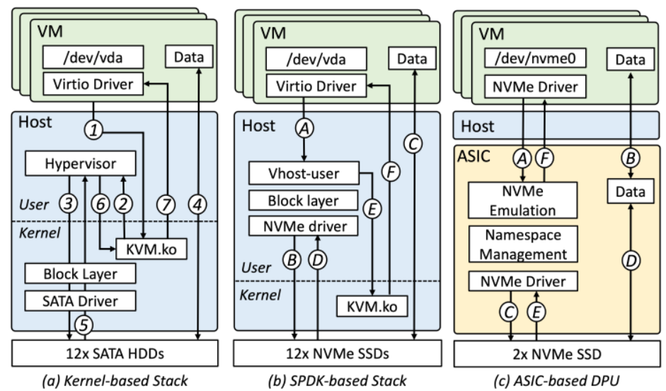
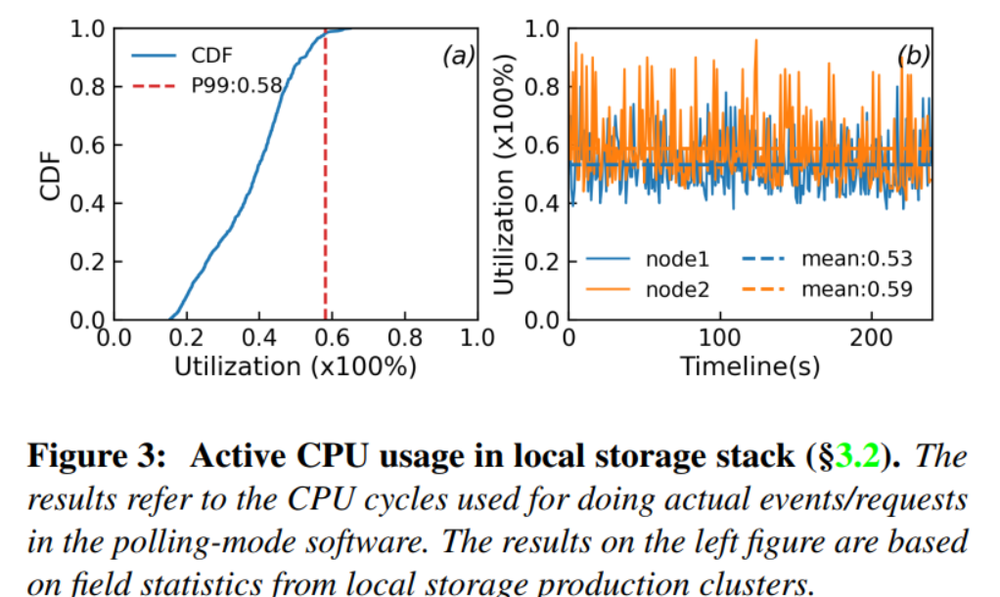
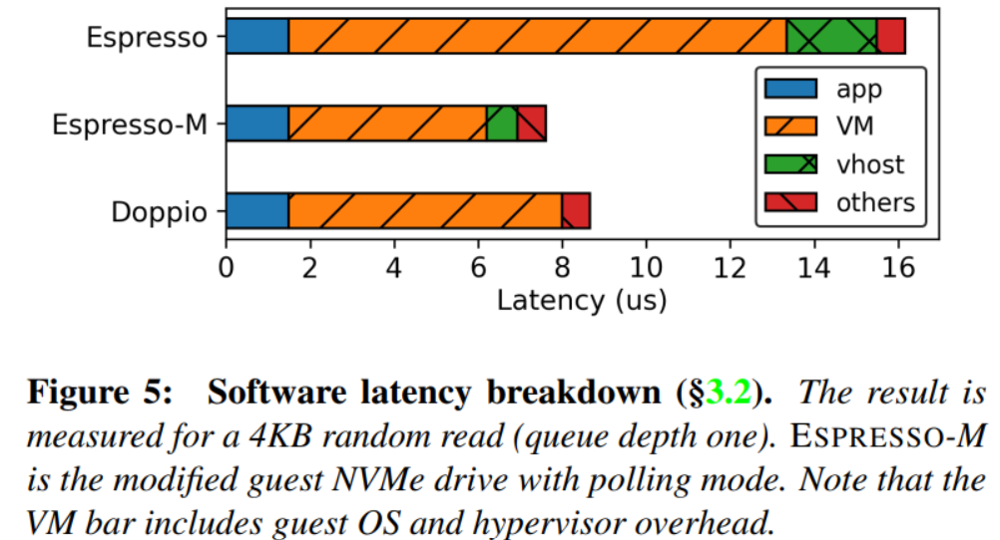
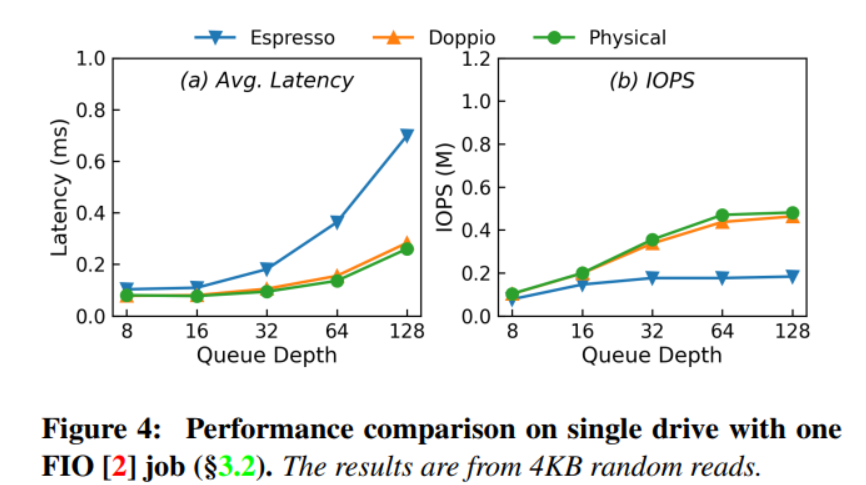
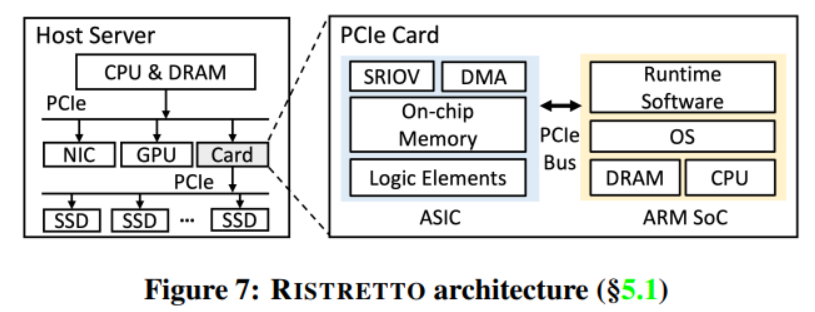
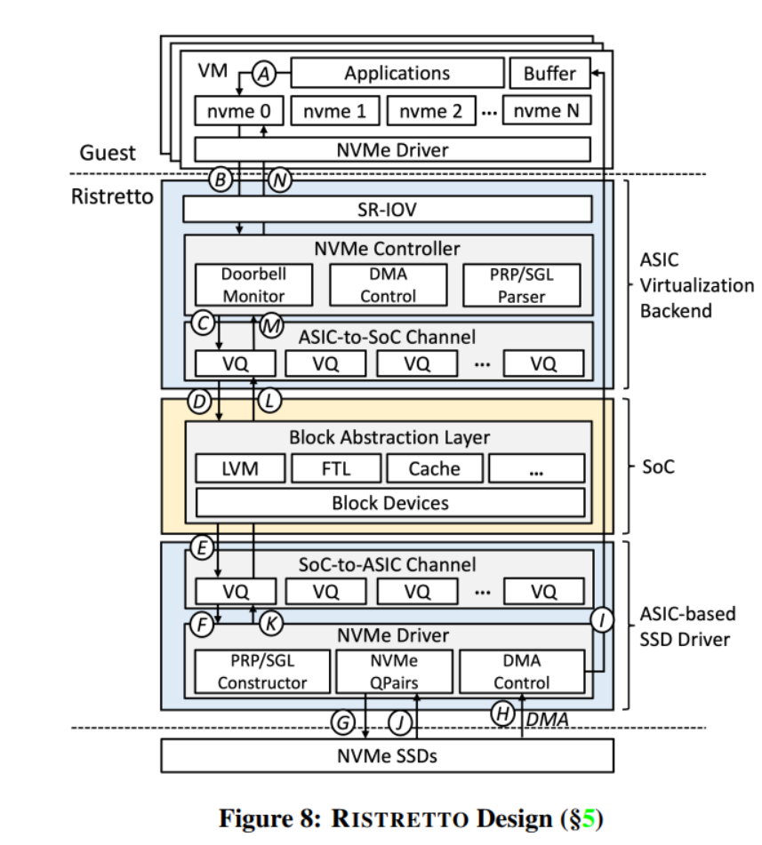
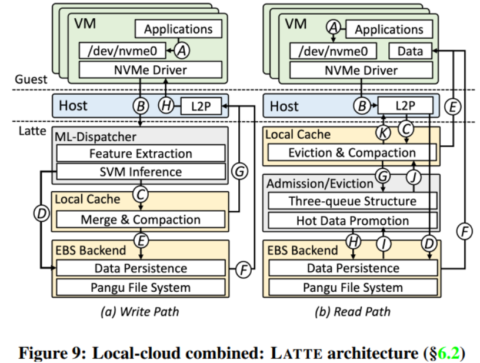

# abstract
回顾阿里云的三代本地存储系统。分析和评价motivation, architectures, pros/cons，包括用户态协议栈、硬件卸载等方式。

探讨未来的存储方向：混合架构，集成Elastic Block Storage以获得更好的性能表现、可用性以及经济价值

# introduction
存储设备，尤其是SSD，近几年的IOPS翻了三倍(500K=>1.5M)，带宽从3GB/s(PCIe Gen 3)到6GB/s (PCIe Gen 4)。但是想要能够充分利用起来这么高的带宽却仍然是一个比较困难的事情。

阿里云一开始尝试直接套用基于内核协议栈的HDD的本地存储方式，但是这一套方式应用到SSD上并不能提供令人满意的表现，因为在高IOPS负载下，存在频繁的上下文切换。

因此阿里云开设了第一代存储架构ESPRESSO。基于SPDK，他们把协议栈移动到了用户态，并通过轮询来减少上下文切换。每个服务器(12X PCIe Gen3 NVMe SSDs)可以最高提供38.4GB/s的吞吐(3.2GB/s per SSD)和5760K IOPS(480K per SSD)。但是，在ESPRESSO中，每个线程处理一个Virtual Disk，并且绑定到一个特定的CPU核上。因此，虽然ESPRESSO在2017年就发布，并且部署到了上千台服务器上，它无法支持裸金属实例，并且CPU利用率很低，同时还是受到来自VM和hypervisor之前上下文切换带来的开销。

阿里云的第二代存储架构DOPPIO，把虚拟化和IO操作卸载到了商用的ASIC卡上(DPU)。硬件辅助避免了使用宿主机CPU（因此可以支持裸金属实例），提高了CPU利用率，并使用更快速的硬件中断而不是软件中断。在使用6个DPU(和12个PCIe Gen3 NVMe SSD)的情况下每个DOPPIO可以达到38.4GB/s的带宽和6M的IOPS。
但是DOPPIO仍然有它的不足。ASIC的DPU功耗有限制，没办法充分利用最新的SSD的1.5M的IOPS的能力。进一步的，固定的硬件逻辑的ASIC也无法提供一些新的云特性（如LVM）。虽然使用一些高性能的FPGA的实现方式可能可以解决部分的问题，但是经济效率可能比较不好。

阿里云的第三代存储架构RISTRETTO，通过联合设计，结合了SoC的灵活性和ASIC的高效性。RISTRETTO作为一个PCIe扩展卡，自带一个ASIC和一个SoC(嵌入式的4个ARM Cortex-A72核心和64GB的DRAM)。其中ASIC用于处理来自VD的请求，并模拟一个NVMe控制器，让SoC能够访问SSD并解包NVMe包。SoC提供一个可定制化的块层次的抽象层。RISTRETTO提供了接近物理性能的表现: 单个VD(PCIe Gen4 NVMe SSD)可达到900K IOPS，8个VD总共可以达到7.2M IOPS

虽然RISTRETTO能提供接近物理设备的性能，但是也继承了一些缺点（低可靠性和低可扩展性）让本地磁盘在很多场景下并不被倾向于使用，如需要动态扩展的LLM系统中。虽然高可靠性的Elastic Block Storage已经可以提供30us的延迟和1M的IOPS，有高可靠性和高可扩展性，但是价格太高。因此本篇论文提出一个Proof-of-Concept，叫做LATTE，以集成本地存储(RISTRETTO)和更价格便宜的的EBS。通过集成基于季琦铉锡的IO分发器和缓存任务控制器，LATTE可以享受到本地存储和EBS带来的优势同时提供接近物理原生的高性能表现和高可靠性，也不会带来太高的经济负担。

+ 分析阿里云的三代云本地存储技术，讨论他们的架构、优势、劣势和设计妥协
+ 提出LATTE，一个混合的本地存储方案，基于阿里云的EBS支持，提供接近物理原生的性能表现，并带有高可扩展性和价格竞争力
+ 对阿里云三代本地存储架构做macro和micro的benchmark分析

# background
#### overview
在阿里云中，虚拟机位于Guest Layer，hypervisor位于Host OS layer，物理硬盘位于Hardware layer。Guest VMs可以挂载一个或多个Virtual Disks。VD是对应到宿主服务器上的一些SSD或者HDD上的。Host OS提供两大主要功能：虚拟化（封装物理盘的分区并作为虚拟块设备）和IO管理（联通VD和物理硬盘之间的命令与数据的传输功能）。

#### near-physical performance
不同于存算分离的弹性云服务（如AWS和阿里云的EBS），磁盘和虚拟机是在同一个物理服务器上的。这个架构消除了虚拟和物理盘之间的长距离的传输带来的损耗。在虚拟机使用本地存储作为VD的情况下，能够获得接近物理原生的性能表现，其中延迟会多出来一些，因为有虚拟化的开销。云中的本地存储的一个典型用处就是在CDN中提供暂存，以及存储大数据分析的中间结果

#### limited elastic and availability guarantees
但是存储和计算节点在一起，也带来了比较脆弱的可靠性和弹性。首先，VD是直接对应到底下的物理盘的，它的可扩展性直接受限于SSD的粒度(至少需要消耗一块盘)。进一步的，VD通常没有冗余保存机制，不管是多份拷贝或者EC码，把这份责任转嫁到了客户APP上。

# ESPRESSO: An SPDK-based Stack
## Kernel-based practice turns outdated

#### stack overview
阿里云的第一代云本地存储技术栈是基于HDD的。该技术栈使用Virtio来在VD和宿主机的内核存储协议栈上传输IO。VM可以挂载一个或者多个HDD（的分区）。控制流和数据流如图2.a所示。

#### infeasible for NVMe SSDs
这个协议栈对于HDD来说是OK的，但是在使用NVMe SSD的时候没办法提供一个让人满意的表现，因为它只能利用到NVMe PCIe Gen3 SSD的9.54%的IOPS，却占用了140%的CPU。当一个VM挂载了来自多个NVMe SSDs的多个VD的时候，情况会进一步恶化。根源是因为SSD的性能远好于HDD，有更高的IOPS和更低的延迟。这会导致频繁且开销巨大的上下文开销，从而导致严重的CPU争用和同步开销。

在图2.a中，有三种上下文开销，包括两个VM-Exit(1&7),两个系统调用(3&6),一个中断(5)。

## ESPRESSO Design
#### architecture
和内核协议栈相比，ESPRESSO最显著的区别就是通过SPDK把协议栈从内核搬到了用户态。如图2.b所示。

在ESPRESSO中，vhost-user进程主动轮询来自客户机操作系统虚拟I/O队列的入站I/O请求。vhost通过用户态协议栈把IO转发到底下的SSD。SSD发起DMA写入数据缓冲区。与此同时，vhost-user继续主动轮询SSD的IO完成状态。最后，vhost-user与KVM模块交互，产生一个中断到Guest OS中，指示IO操作已经完成。

##### benefits
+ 用户态协议栈和轮询模式避免了频繁的上下文切换导致的VM-Exit(A vs 1)，系统调用(B vs 3)和中断(D vs 5)
+ 绑定专门的CPU核心来充当IO轮询线程，并为每个线程采用无共享的数据节后，提高了CPU核心的亲核性并最小化了CPU资源竞争和同步带来的开销。
+ 基于成熟的开源生态和库。有广泛的社区支持

##### field deployment
ESPRESSO可以达到3848K IOPS，400%的CPU占用率；传统内核协议栈+Virtio则是440K IOPSqt却又340% CPU占用率。

##### limitations
软件带来的限制

+ 不支持裸金属实例
+ 没有高效利用宿主机CPU: 在ESPRESSO中，每个专用核心都专门用于处理请求。但是如图3所示，实际利用率的第99%百分数低于60%。而且由于突发IO导致CPUliyslv不可预测（如3.b）以及上下文切换的高昂成本，这种状况无法简单通过讲空闲CPU用于其它任务来解决。
+ 没有完全解决上下文的开销: 在ESPRESSO中，在完成一个IO操作后，SPDK触发一个eventfd来告知虚拟机IO请求的完成。这个带来了额外的上下文切换，包括系统调用和VM-Exit(2.b中的E和F)，从而增加5~12us的处理时间。因此，随着队列深度的增加，ESPRESSO与物理磁盘之间的性能差距会进一步拉大

在图5中，对原始的ESPRESSO进行了改进（虚拟机内部采用轮询驱动，IO完成时候就没有上下文切换了）进行了延迟分解。结果显示，客户机操作系统和hypervisor的软件延迟（图中VM部分）降低了60.3%，vhost协议栈降低了65.6%。然而，对于许多仍然依赖中断机制的用户遗留应用程序而言，上述延迟仍然是不可避免的。

# DOPPIO: An ASIC-offloading Stack
## DOPPIO design
#### ASIC-based offloading
DPU最初是从NVMe RAID卡或者NVMe Switch上演化出来的，用于提供虚拟化的能力给宿主机(SR-IOV)。用户可以通过SR-IOV创建VF来模拟多个PCI设备，并且直接把VM接入到VM里面。因此他们能够提供把本地的存储协议栈从软件卸载到硬件，从而能够解决ESPRESSO的第三个短板。又因为相关的计算逻辑是在ASIC上的而不是在宿主机CPU上的，这些DPU可以不占据宿主机CPU能力，进而降低能耗。典型的来说，一个ASIC-based DPU的能耗是一个SoC-based DPU能耗的1/20到1/3.因此，阿里云采用了一个商用的基于ASIC的DPU来做DOPPIO而不是SoC的。

#### architecture
在DOPPIO中，DPU配备了一个ASIC，128KB的SRAM，DMA engine和16条PCIe Gen3通道。DPU直接插在了宿主机的PCIe总线上。每个DPU可以通过片上PCIe Root Complex来处理两个PCIe Gen3 NVMe SSd。进一步的，阿里云利用DPU来把每个NVMe SSD划分为一个或者多个的命名空间，并把一个VF注册到一个命名空间上，然后把VF分配给VM，通过PCI passthrough的方式为VM提供VD

图2.c进一步展示了该方案中的控制和数据流。当VM向VD提出了IO请求后，DPU可以从宿主机上的DMA engine中获取到NVMe请求，在把IO请求转发给SSD之前，执行硬件定义的功能（如限流、设备共享）等。在SSD完成IOcczo后，DPU通过MSI中断（硬件中断）。值得注意的是，DPU中的DRAM充当了用户数据的中间缓冲区。DPU需要先将数据从宿主机移动到它的缓冲区。只有当SSD把读/写数据放入/拿出中间缓冲区后，才会告知系统IO完成。

#### benefits

+ DOPPIO不需要占用宿主机的CPU来做IO，因此能够支持裸金属实例，并提高宿主机CPU的有效利用率
+ DOPPIO提供了硬件辅助的虚拟化功能，通过DPU支持的硬件中断替代由软件引发的系统调用和VM-Exit的上下文切换开销。在相同条件下（图4和5），都带来了延迟和IOPS的提升。
+ 保留了通过ASIC执行硬件定义功能和管理存储设备的能力

#### limitations
+ 难以跟上SSD的演进步伐。商用ASIC的性能提升跟不上SSD的性能提升。
+ 无法满足云场景的各种特性的需求。ASIC一般只专门优化用户做特定的功能。因此相比于ESPRESSO，DOPPIO缺乏灵活性，难以整合那些需要host管理的新兴技术。

# RISTRETTO: an ASIC/SoC Co-design stack
目标是通过软件硬件协同的方式来实现：
+ 不占用宿主机CPU以提供裸金属实例的功能，并且能够为VM预留更多的核心
+ 能够把中断穿透进入到虚拟机，以避免hypervisor处理带来的延迟
+ 确保性能表现和可扩展性能够跟得上SSD技术的迭代演进
+ 为云厂商提供灵活的云相关特性

##  RISTRETTO design

图7展示了RISTRETTO的架构。对上层而言，RISTRETTO就是一个PCIe扩展卡，上面可以插多个NVMe SSD，直接连接到宿主机服务器上。RISTRETTO可以把SSD分区，或者所有的SSD通过SR-IOV注册为VFs。每个VF分配给一个虚拟机，被挂载为一个VD。

RISTRETTO有两个主要的成员：ASIC和ARM Soc。ASIC包括一个DMA EDngine和一个片上内存用于存储卸载和加速。SoC是一个ARM Cortex-A72处理器，4核64GB DRAM，运行Linux OS和相关软件栈。ASIC和SoC通过一个内部的PCIe总线连接，并集成到一个PCIe板子上，带有32条PCIe Gen4通道，通过PCIe Root Complex连接到宿主机服务器上，并通过PCIe Endpoints管理SSD。使用ASIC逻辑单元来实现所提出的硬件设计，该设计可支持超过1000个虚拟功能（VF）用于NVMe控制器模拟。硬件通过轮转调度轮询的方式模拟NVMe寄存器和IO完成事件。

#### ASIC virtualization backend
RISTRETTO中的ASIC提供了虚拟化后端的功能。(1)它可以配置VF为虚拟NVMe设备，并将其作为标准NVMe存储设备分配给VM。(2)VM的IO完成通知通过ASIC的DMA写操作触发MSI中断，该操作经由PCIe子系统向主机的特定地址写入数据来实现。(3)为了从客户虚拟机传输NVMe命令，ASIC会获取新的命令的偏移量，对相应的主机内存区域发起DMA读操作，讲IO完成信息写入主机内存中的NVMe完成队列区域。此外，ASIC还通过虚拟队列建立了ASIC到SoC的通道，用于传输用户请求。

#### ASIC-based SSD driver
RISTRETTO通过让ASIC与SoC通过virtual queues交互的方式建立SoC-to-ASIC的通道。ASIC把数据封装到Physical Region Pages或者Scatter Gather List，把block request转换为NVMe requests。ASIC通过把DMA路由到guest OS实现直接的数据传输（零拷贝）。当SSD通过PCIe总线发起一个DMA请求的时候，ASIC把DMA请求路由到宿主机上的内存空间中。

#### runtime software on SoC
运行时软件是在ARM SoC上，基于SPDK框架实现连续轮询来自virtual queue中新来的IO请求，并于ASIC交互，通过ASIC-to-SoC通道来确定队列映射关系。在此过程中，RISTRETTO在绑定到专用CPU核心的线程上注册了一个SPDK轮询器，专门用于IO请求的获取。

进一步的，我们设计了两个软件功能：(1)通过SPDK BDEV(block device)提供一个block抽象层以处理普通的block IO请求和云相关的功能，以提供高级的存储特性，包括LVM，RAID，Caching, Flash Translation Layer等等新特性，以适配新的硬件，如ZNS SSDs。(2)运行时软件于ASIC通过Soc-to-ASIC通道交互，使用SPDK轮询器来重复轮询virtual queue以检查是否有IO完成事件。为了最小化CPU负载，运行时软件被设计为仅负责处理block level的请求，并直接把请求转发给ASIC。

#### multiple queues support
对于RISTRETTO中的每一个块设备，运行时软件都分配多个虚拟队列到ASIC-to-Soc和SoC-to-ASIC通道中，对应到相应的的VM的NVMe队列数量。例如，如果guest OS里面配置为有多个queue pairs(e.g. 4 NVMe queues)，RISTRETTO运行时会分配4个virtual queues到ASIC-to-Soc通道用于VM通信和4条virtual queue到Soc-to-ASIC通道用于和底层的SSD通信。

## RISTRETTO Data flow
以一个例子来说明

+ 用户程序通过调用NVMe驱动，向VD发送一条IO请求。NVMe驱动会向Submission Queue中添加一条NVMe命令，并用当前SQ队尾的内容来更新virtual doorbell register(mapped ASIC BAR)
+ RISTRETTO NVMe控制器接收到doorbell的消息，利用它的DMA engine获取获取最新的一条NVMe命令
  + 宿主机的IOMMU负责再这个阶段中把地址从guest转换为host地址
  + NVMe控制器解析NVMe PRP/SGL，并将其转换为block IO，提交到ASIC-TO-Soc的virtual queues中
+ 运行时软件从VQ中轮询请求，获取到新的请求后，将其提交到block abstraction layer。再block abstractino layer中，RISTRETTO执行一些云特定的功能，如宿主机侧的FTL为ZNS SSD硬盘，通过B+树索引把Logical Block Address转换为Physical Block Address
+ 把新的block IO请求转发到Soc-to-ASIC的VQ中。ASIC不停的检查来自VQs中的新来的请求，解包收到的block请求为标准NVMe包，并通过标准的NVMe queue pairs与NVMe SSD交互
+ SSD从它的doorbell register中获取到通知，从RISTRETTO的DRAM中抓取NVMe命令。解析完命令后，SSD发起一个DMA请求，ASIC将捕获这个请求，并路由到guest OS中的用户数据缓冲区中。
+ 在IO完成后，SSD把IOfjhv到NVMe Queue Pairs中。
  + 在接收到IO完成的消息后，ASIC把NVMe请求解析并把这个完成了的请求添加到VQ中。
  + 运行时软件不停的轮询VQs并根据云的特定功能执行block level的操作
    + 之后，运行时软件把完成了的请求移动到VQ中
  + RISTRETTO NVMe控制器主动轮询ASIC-to-Soc通道中的VQ检查是否有结果，并通过DMA把完成了的IO请求返回到宿主机的NVMe CQ中，紧接着向guest OS发送一个硬件中断。
  
#### benefits
+ 类似于DOPPIO，RISTRETTO把完整的IO协议栈卸载到了DPU(ASIO & SoC)上。因此，RISTRETTO完全不依赖于宿主机CPU，可以支持裸金属，也提高了宿主机CPU有效利用率
+ 受DOPPIO中的硬件中断的启发，RISTRETTO让ASIC能够通过PCI passthrough和intel VT-D的辅助下直接注入硬件中断(MSIs)到guest OS中
+ 重新设计ASIC以提升并行执行效率，提升了计算能力，从而适应存储设备的演进
+ 利用SoC CPU的灵活性来实现云定义的功能，如LVM和FTL
+ 通过在ASIC和SoC之间分担任务，RISTRETTO相比仅由于SoC承担任务的方案，实现了更强大的计算能力，并优化了总体成本

#### limitations
+ 可用性: 单盘的故障（年平均故障率为0.44%）对于本地存储用户来说一般是可以接收的（因为一般是作为CDN网络）。但是，这样用户需要忍受小时级别的不可用。这是因为用户可能拥有多个本地SSD，并需要他们全部完好才能够运行他们的服务。在这样的情况下，虽然可以新分配出一个新的节点，用户仍然需要迁移数据，又带来了很高的开销。因此，本地存储的用户仍然希望能够拥有更高的可靠性。
+ 弹性: 最近的一些应用会需要高弹性的空间（如LLM需要临时存储checkpoints）。使用物理磁盘的方式限制了disk的scale up的能力
+ 可访问性: 一个不太广为人知的事实是，本地存储仅在那些拥有大量本地存储用户（拥有超过1000块盘）的特定区域才具备可行性。这是因为物理上的Co-location，与云盘的存算分离不同，限制了资源的可访问性；如果用户数量不足，就会导致资源利用率低

# future of local storage
RISTRETTO的不足展示出了云的本地存储需要解决的可扩展性、可靠性和灵活性的问题。幸运的是，这些必要的特性可以继承自Elastic Block Storage的优势。因此，在以下阿里云提出的未来本地存储形态中，都将依托 EBS 的这些优势: 一个是被称为EBSX的、经过性能优化的阿里云EBS版本；另一个是名为LATTE的、本地与云端相结合的存储架构栈。

## EBSX作为本地存储
#### overview
EBS是一个现代云的基础模块，之所以能够吸引作者的注意力，想用来作为本地存储的原因是，因为它通过virtual block device的方式提供存储服务，并且拥有高性能、高可靠性和高弹性。

+ 在阿里云的EBS架构中
  + compute end是由多台服务器构成，每台服务器运行一个客户端，并能够支撑多个虚拟机。一个VM可以挂载一个或多个VDs。用户可以通过以块设备访问的方式访问VD，宿主机服务器通过运行的这个客户端把IO请求转发到存储集群
  + storage end采取了基于自研分布式文件系统的专用存储服务器。这些服务器采用日志结构化设计，讲VD的写入操作转换为文件系统中的追加写入操作，数据跨节点存储的时候采取三副本或者在线EC码压缩格式。

#### pros and cons of adopting EBSX as local storage
相比于物理位置旧在一起的本地存储，EBS多亏了存算分离，天然提供了更好的可靠性，可扩展性和可访问性。进一步的，阿里云的EBSX，还可以提供30us的延迟，6GB/s的带宽和最高1M IOPS。不行的是，这个解决方案需要更高的价格。另一方面，EBS的这种高可靠性，对于一些采用本地存储的场景来说有点性能过剩、过度设计了。

## LATTE: Local-Cloud Combined Storage
EBSX太贵了，劝退。但是把EBSX和本地存储结合起来，就价格比较亲近。在这样的解决方案中，在前端（本地存储）作为高性能的缓冲区来做IO，并降低tail latency，缓存热数据。后端则通过EBSX来做支撑。

基于这个想法，论文提出了LATTE。虽然混合存储架构不是一个什么新的思路，但是很多的工作都需要跟机型的大改才能够适配到现有的阿里云的这一套用户态协议栈。

[`Flashield`](https://www.usenix.org/conference/nsdi19/presentation/eisenman)是基于Memcached建立的，而[`Ziggurat`](https://www.usenix.org/system/files/fast19-zheng.pdf)依赖内核级别的修改。

因此，LATTE是基于[`CSAL`](https://dl.acm.org/doi/10.1145/3627703.3629566),一个基于SPDK的方案。CSAL使用Optane来吸收新到达的写IO，把它们压缩成为固定大小的块，在追加到底下的QLC SSD上。

LATTE通过用本地磁盘替换掉Optane，并用远程云磁盘替换QLC SSD，从而利用CSAL。同时，还改进了三个部分：
+ 采用基于机器学习的调度器，用于判断传入的IO是否需要存储在前端（本地磁盘）或者后端（即云磁盘）
+ 采用S3-FIFO捐赠在来实现更优的缓存，而非传统的LRU
+ 移除了日志就够的压缩和垃圾回收，因为云盘已经支持了这些功能

### key procedure

#### 写路径
存在写入缓存和绕过缓存两种路径，当应用程序发起写入IO请求时，它首先被路由到ML分发器模块。随后，每个IO的推理过程会将请求导向写入缓存或者后端。当前端磁盘出现故障的时候，可以把请求自动路由到后端。写入IO完成后，Logical-to-Physical地址表会被更新，以记录数据是写入了后端还是缓存，并通知虚拟机。需要注意的是，前端还会定期对写入操作进行聚合，并将其刷新到后端。

#### 读路径
采用S3-FIFO的三个FIFO队列结构，用于记录并提升频繁访问的数据块，从EBS到基于RISTRETTO的缓存。具体而言，读取请求首先检查L2P，以确定数据的位置（即是在前端还是在后端）。在前端的话就直接返回给虚拟机，否则，admission controller会评估这个数据块是否应该移如前端缓存。如果这个块被频繁的访问，那么就在被送入VM的同时插入到前端缓存中。如果前端缓存的空间不够了就会触发压缩操作，系统会评估一些数据块是否还值得被留在前端。如果不值得了，或者直接是失效数据，那么就会被踢出去。当一个数据块被添加/剔除的时候，都会相应的更新L2P的数据。

值得朱岳程的是，LATTE可以保证写操作的顺序，不管是写到cache上还是刷到后端上，写操作都是追加模式的，并且哪怕是在压缩阶段，两种写的顺序仍然是相同的。这种机制避免了传统写回方法中出现乱序驱逐和数据不一致问题。此外，L2P映射回持续跟踪最新数据位置，以确保读取一致性，测与CSAL中的数据管理方式相同。

### ML-based dispatcher
LATTE的高性能依赖于IO路径的选择，以避免后端设备的拥塞。收到近期机器学习在预测IO路径延迟上的启发，我们构建了一个轻量级的基于机器学习的IO调度模型，包括以下内容

##### model input output
我们收集每条IO的缓存路径和后端延迟，IO大小，以及队列失风度。通过使用滑动窗口作为输入，模型输出二项分类。

我们通过为比较缓存，后端延迟和队列深度拥塞程度来标记每个窗口，让模型能够学习到防止IO阻塞的最优路由选项。

##### model selection
我们选择线性SVM来作为快速学习的边界学习，而且推理延迟最多为200ns，是一个可以忽略的开销（SSD的延迟在10us以上）。模型的系数参数（5*6个输入参数对应30次权重更新）占用空间不到1KB，即使在1M IOPS下，CPU开销也低于10%

##### model retrain
鉴于IO模式的多样性，我们每60秒收集一次LATTE的吞吐量和平均延迟，以进行统计分析。如果方差高于预定义阈值（默认10%），将使用段时IO的trace重新训练模型，并相应的更新权重，鉴于trace数据集较小，并且采用了轻量级模型，这个过程平均只需要5s

### admission and eviction
solidigm的追加缓存技术，是一个集成了S3-FIFO-的三队列结构体到SPDK中的技术。该论文在这个的基础上，实现了cache admission和eviction control的能力。

在第一次发生read miss的时候，数据块并不是立即被插入到缓存里面，而是被记录在一个仅维护IO元数据的候选队列中。只有当某个数据块作为admission candidate的次数超过一次以后，才会被添加到缓存里面。

这样的设计是为了解决这样的一个问题：在整个IO轨迹中，较短的请求子序列（如10%）往往具有更高的”一击即中“的比率（72%），即轨迹中仅被请求一次的对象所占的比例。当缓存占用超过容量阈值并触发eviction的时候，eviction controller回查阅访问记录，仅保留最近访问过的数据块（LRU），从而提高缓存中热数据的比例。

实验结果表明，LATTE的缓存设计在真是的IO trace中实现了超过82%的读取命中率，并且在混合读写数据库工作负载中性能接近EBSX。

### benefits
通过构建本地-云混合存储协议栈，LATTE可以有以下的优势
+ 高性能，但是价格低
+ 可用性：LATTE中的所有数据最终都会通过压缩或刷新操作路由到EBS后端。从长远来看，LATTE可以实现与标准EBS相同的可用性和可靠性。在写回模式下，如果本地磁盘故障，本地磁盘中尚为刷新的数据可能回丢失，但LATTE仍可通过路由到后端来访问。此外，用户可以发出O_DIRECT/O_SYNC命令，以触发LATTE的写穿模式，确保数据始终在EBS上有副本，从而实现更强的持久性。
+ 弹性：LATTE能够（暂时）扩展到更大容量的后端，允许LATTE弹性地增加或减少IOPS
+ 可访问性：由于用户不再依赖本地磁盘的容量（容量由EBS支持），一个本地磁盘可以被分割为多个LATTE实例。因此，供应商不需要再每个节点上都配备多块SSD，而只需一块，就可以实现够好的可访问性

### future work
目前LATTE只是概念。
+ QoS：本地磁盘可再多个LATTE实例之间共享。再同时发生IO突发的情况下，用户可能遇到明显的性能下降。因此，由于工作负载的多样性，供应商可能难以维持QoS
+ 成本更低：本地存储用户可能不需要高可靠性，所以EBS可能对它他们而言也是不必要的
+ 更只能的路由/缓存：现在的路由ML调度器准确率再95.6%，缓存命中率再87.3%。

# evaluation
## micro benchmark